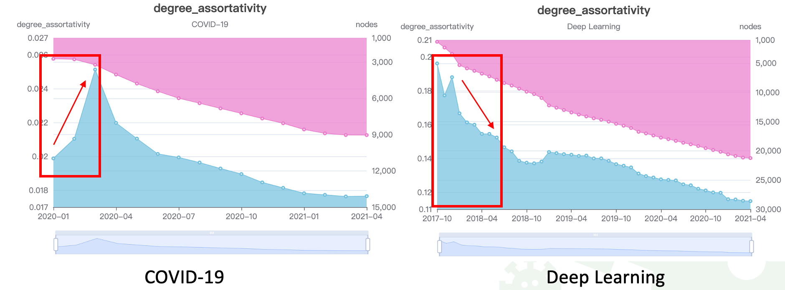

# DeepScience

## Introduction

In this repo, we choose the domain of **COVID-19** and **deep learning** to predict the trends of the science of science. 

We use the information of papers and fields from [Acemap](https://www.acemap.info/). It is worth noting that we have also collected papers from the whole academia consisting of 19 subjects (Mathematics, History, Psychology, Economics, Sociology, Art, Geography, Business, Physics, Political science, Philosophy, Biology, Computer science, Materials science, Environmental science, Medicine, Chemistry, Engineering, and Geology) and 292 sub-fields (sub-subjects). 

To predict the academic trends, we construct a field graph based on citations among papers. Specifically, the papers we crawled have been labeled with fields. Each paper may belong to several fields. We use citation information to link these fields. For example, paper P1 belongs to field F1 and F2, paper P2 belongs to field F2 and F3, also, P1 cites P2. Then, we add edges (F1, F2), (F1, F3), (F2, F2) and (F2, F3), and the weight of each edge is the total number of citations in terms of fields. The ids of nodes can be found on Acemap, for example the id of Business is 2024422753, then, you can find it by visiting https://www.acemap.info/field/2024422753.


## Statistics

We generate the dynamic field graph day by day ranging from January 1, 2020, to March 31, 2021 (456 days) for COVID-19. As to deep learning, the time range is from October 1, 2017 to  March 31, 2021. Finally, the dynamic field graph is constructed, and we called it the COVID-19 (Deep Learning) academic graph.

You can download these two datasets from [Google Drive](https://drive.google.com/drive/folders/11GArAGnx655sOrDBPm5BwKH-eDsUJvQX?usp=sharing).

|  | COVID-19 | Deep Learning |
| :----| :---- | :---- |
| Fields | 18,369 | 40,930 |
| Relations | 198,137 | 669,426 |
| Relations (weight > 1) | 54,106 | 186,255 |


## Analysis

### Motif Trends

The cross topic motifs of the two fields are on the rise, and the number of cross topics of deep learning is far greater than that of COVID-19. In the late stage of the epidemic, the cross trends slowed down and reached convergence. From the end of 2018 to 2019, there was an explosive growth in deep learning domains. Although deep learning has slowed down in recent months, compared with the COVID-19, it still has great development prospects.


### Network Characteristics

We also compute several network characteristics of field graphs. More details can be found in our paper.





### Hot toptics

We use [GCN-GAN](https://github.com/yanghaoxie/GCN-GAN-for-Weighted-Dynamic-Networks) and [EvolveGCN](https://github.com/yanghaoxie/GCN-GAN-for-Weighted-Dynamic-Networks) to forecast trends of cross subjects in the future.


In terms of COVID-19, we finds that:

- Computer aided medical treatment deepens the reform of internal medicine diagnosis
- Surgery pays more attention to risk assessment
- Online medical diagnosis further ensures user privacy
- The intersection of endocrine surgery continues to increase
- Medical waste management will give more consideration to environmental protection
- Machine learning assisted demographic analysis of epidemic situation

### Transfer Entropy

Transfer entropy is a non-parametric statistic measuring the amount of directed (time-asymmetric) transfer of information between two random processes. We use transfer entropy to mine the underlying influence between different fields in the perspective of PageRank. More details can be found in our paper.


If you use this repository, please cite it as below.

```
@software{Yi_DeepScience_2022,
author = {Yi, Xu and Zhe, Li and Yihan, Zhang},
month = {3},
title = {DeepScience},
version = {0.1.0},
year = {2022}
}
```


